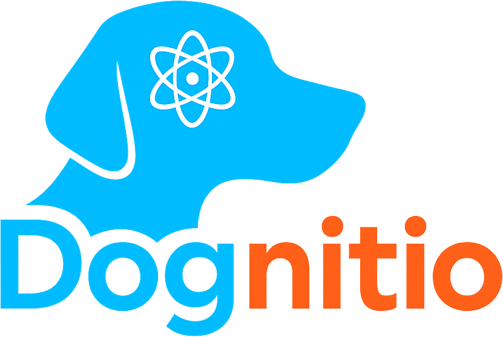

  

    
  

  
  
  
  
  
  

---

  <h1>PROTOCOLES D'ENTRAINEMENT</h1>
  <em>Bibliothèque</em>

---

Vous trouverez ici le catalogue des protocoles d'entraînement du framework ANIMA. Chaque protocole est une adaptation opérationnelle d'un paradigme scientifique validé, conçu pour cibler et stimuler une ou plusieurs fonctions cognitives.

Cette page est organisée en deux sections pour une flexibilité maximale :
1.  **La liste alphabétique** ci-dessous décrit chaque protocole disponible.
2.  **L'index par fonction** (plus bas) vous permet de trouver rapidement les outils les plus pertinents pour une compétence cognitive que vous souhaitez entraîner.

*Note importante : La sécurité et le bien-être de l'animal sont prioritaires. Ces protocoles sont des cadres de référence qui doivent toujours être adaptés à l'individu. Un protocole ne doit jamais être poursuivi si l'animal montre des signes de stress ou de frustration excessive. Cette bibliothèque est évolutive et sera enrichie continuellement.*

---

## Liste Alphabétique des Protocoles

- **[Apprentissage Inversé (Reversal Learning)]**
  *Mission : Entraîner la capacité à inhiber une règle apprise au profit d'une nouvelle.*

- **[Jeu des Gobelets (Shell Game)](./protocoles/shell-game.md)**
  *Mission : Entraîner le suivi et la mise à jour de plusieurs informations spatiales en mouvement.*

- **[Résolution de Problèmes en Plusieurs Étapes](./protocoles/multi-step-problem-solving.md)**
  *Mission : Renforcer la capacité à comprendre et exécuter une séquence causale d'actions.*

- **[Tâche à Réponse Différée](./protocoles/delayed-response_task.md)**
  *Mission : Améliorer le maintien d'une information spatiale simple malgré un délai.*

- **[Tâche de Décision d'Effort](./protocoles/effort-based-decision-making.md)**
  *Mission : Mesurer et moduler la propension à investir de l'effort pour une récompense.*

- **[Tâche de Flanker](./protocoles/flanker_task.md)**
  *Mission : Renforcer la résistance à l'interférence des distracteurs.*

- **[Tâche Go/No-Go](./go-no-go_task.md)**
  *Mission : Renforcer l'inhibition de réponse proactive (retenir une action).*

- **[Tâche Stop-Signal](./protocoles/stop-signal_task.md)**
  *Mission : Renforcer l'inhibition de réponse réactive (annuler une action en cours).*

- **[Tour de Hanoï](./protocoles/tower-of-hanoi.md)**
  *Mission : Entraîner la formulation d'un plan en plusieurs étapes en respectant des contraintes.*
